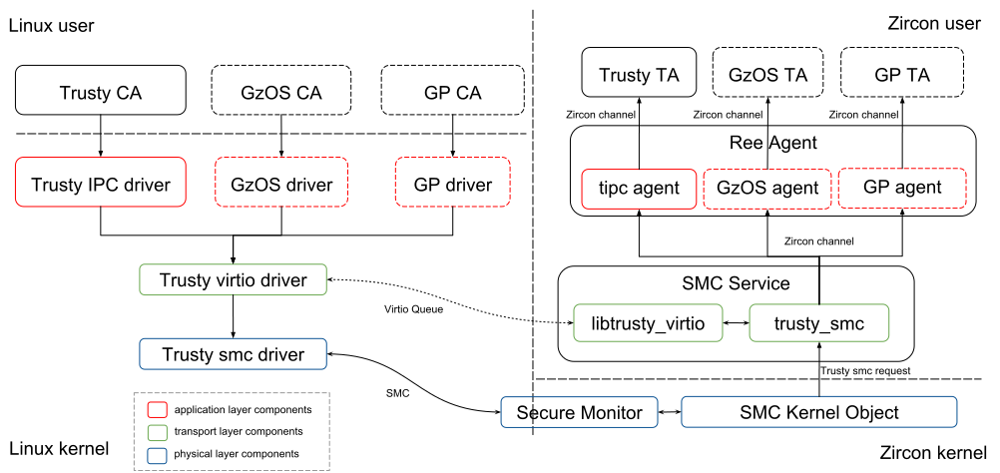

# GzOS System Architecture

## System Overview

GzOS is a trusted operating system that executed in [Trusted Execution Environment(TEE)](https://en.wikipedia.org/wiki/Trusted_execution_environment). Shortly speaking, TEE is an isolated and secure computing environment that can be used for executing applications that have higher security requirement. For example, data encryption/decryption, Digital Rights Management(DRM), face unlock...etc.

A system can build a TEE via the following hardware or software technologies:

* [ARM TrustZone technology](https://www.arm.com/products/security-on-arm/trustzone)
* Hardware or software [virtualization technologies](https://en.wikipedia.org/wiki/Virtualization)
* Dedicated processing unit(e.g. [Trusted Platform Module](https://en.wikipedia.org/wiki/Trusted_Platform_Module) and [Qualcomm Secure Processing Unit](https://www.qualcomm.com/snapdragon/security)).

No matter which technology is used, the system should provide isolated and dedicated physical resources (e.g. computing resource, memory, IRQ, I/O ports, timers..., etc.) for TEE to execute trusted applications or host a trusted OS. Also, the system should provide an IPC mechanism between REE(Rich Execution Environment, a non-secure computing domain) and TEE. Thus, client applications(CA, executed in REE) can issue commands to trusted applications(TA).


### Three Layer IPC Protocol Architecture

GzOS based on the Trusty TEE IPC implementation to develop the three layer IPC protocol architecture. The functionality of each layer is described as below:

#### Physical Layer

This layer is responsible for data exchange and notification between different execution environments. With ARM TrustZone technology, **SMC(Secure Monitor Call)** is used for notification and normally a shared memory region is used for data exchange. If TEE is constructed as a virtual machine by a type 1 hypervisor, the hypervisor should provide notification(e.g. virtual interrupt) and data exchange(e.g. shared pages) mechanism for communicating between the virtual machines of REE and TEE.

#### Transport Layer

This layer provides bi-directional message channel for efficiently data transfer between **client service** and **agent**. Virtio is a technology widely used in the field of I/O virtualization. GzOS uses **virtio queue** as the transport layer protocol. Different client services can communicate with it's agent via different virtio queue channels.

#### Application Layer
This layer provides high level communication API for CA and TA. For example, Trusty TEE provides [Trusty API](https://source.android.com/security/trusty/trusty-ref), OP-TEE provides [GlobalPlatform(GP) client API](https://globalplatform.org/specs-library/tee-client-api-specification/). GzOS support Trusty API by default. But GzOS can also support other API specification by implementing a pair of **client service** and **agent**. The client service and agent are responsible for creating logic channel(or session) between CA and TA and also responsible for dispatching messages back and forth between CA and TA.

### GzOS Implementation

Before continue introducing the software components of each layer, the system environment requirement for running GzOS should be introduced first.

For now, GzOS([v0.1.0](https://github.com/OpenTrustGroup/manifest/blob/gzos/release/CHANGELOG.gzos.md)) only support ARMv8 64bit cpu architecture and can only be executed in TrustZone.

The software components in REE side are leveraged from Trusty TEE, including Trusty Linux drivers and Trusty IPC test program. Linux is the only one rich OS supported by GzOS(v0.1.0) currently.

GzOS uses [Zircon](https://fuchsia.googlesource.com/zircon) (the core of Fuchsia OS) as its core platform. Due to the big difference of the kernel design philosophy between Zircon and Trusty TEE, the software components in TEE side should be redesign and re-implemented. Since Zircon is based on microkernel architecture and has capability-based security model, most of the TEE software components are implemented in user space and only small fraction of code that required to access privileged resource (e.g. smc instruction) is implemented in kernel space.

## Software Components



### [Trusty Linux driver](https://github.com/OpenTrustGroup/linux/blob/gzos/drivers/trusty/)

The Trusty driver can be separated into three layers, that is, (from the bottom to the top) Trusty smc driver, Trusty virtio driver and Trusty IPC driver for handling SMC, virtio and Trusty IPC protocol respectively. It also has two important missions. First one is to handle the REE/TEE shared memory for data exchange.  Second one is TEE [IRQ routing](https://github.com/OpenTrustGroup/linux/blob/gzos/drivers/trusty/trusty-irq.c); when a TEE IRQ occurs, the driver will create a worker thread for entering TEE to handle IRQ. The driver has a log feature which can dump the TEE log messages into Linux log buffer for debugging, but GzOS does not support this feature yet.

In the future, GzOS will support GP client API or even the GzOS proprietary IPC protocol by implementing different top layer Linux drivers to handle different IPC protocols.

### [Secure Monitor](https://github.com/OpenTrustGroup/zircon/tree/gzos/third_party/lib/sm) and [SMC Kernel Object](https://github.com/OpenTrustGroup/zircon/blob/gzos/kernel/object/smc_dispatcher.cpp)

There are only two TEE software components implemented in Zircon kernel, that is, secure monitor and SMC kernel object.

Before ARMv8 cpu architecture, TrustZone requires a secure monitor firmware that help to do world switch between REE and TEE. For the ARMv8 cpu, the burden is offloaded to [ARM Trusted Firmware](https://github.com/OpenTrustGroup/arm-trusted-firmware/tree/gzos). In GzOS, the secure monitor is a software component in Zircon kernel for:

* Dispatching smc requests from REE.
* Returning to REE when REE IRQ occurred. That is, if a REE IRQ occurs but cpu core is still owned by TEE, TEE should return to REE immediately to minimize the IRQ latency.
* Returning to REE when TEE is idle.

Zircon has a [capability-based](https://en.wikipedia.org/wiki/Capability-based_security) security model. Kernel object is the kernel service provider. If an userspace process need to access a specific kernel service, it should be granted to have the capability to create or get access to a specific kernel object. GzOS by default grant the SMC kernel object creation capability to the smc service in userspace.

The functionality of SMC kernel object is as follows:

* Dispatching smc request to smc service.
* Creating a REE/TEE shared memory kernel object and transfer the capability to smc service.

### [SMC Service](https://github.com/OpenTrustGroup/garnet/tree/gzos/bin/gzos/smc_service)

Smc service provide a function for registering smc entity handlers. Except that the secure monitor smc request is handled by the secure monitor, all other smc request are handled by the corresponding smc entity handler according to the smc entity ID of the request.

Currently, only the [Trusty smc entity handler](https://github.com/OpenTrustGroup/garnet/blob/gzos/bin/gzos/smc_service/trusty_smc.cc) is implemented. This handler is mainly used for handling Trusty virtio protocol in transport layer. (please refer to [libtrusty_virtio](https://github.com/OpenTrustGroup/garnet/tree/gzos/lib/gzos/trusty_virtio) for detail Trusty virtio implementation)

The Trusty smc entity handler object is also responsible for creating the virtio bus and virtio devices according to the [resource table](https://github.com/OpenTrustGroup/garnet/blob/gzos/lib/gzos/trusty_virtio/trusty_virtio_device.h) when doing initialization. Typically, each virtio device owns a virtio queue and provides a logical connection between client service and the corresponding agent. The resource table is kept in TEE side and is for storing virtio device configurations, for example, virtio device ID, number of virtio rings, number of vring buffers, vring buffer size, ..., etc.

The following is the virtio commands handled by Trusty smc entity handler:

**Get Descriptor**

This command is for REE side to retrieving the resource table.

Rich OS should create and initialize the virtio devices and queues according to the virtio device configurations in resource table for communicating with the corresponding agents in TEE side. The virtio ring buffers of a virtio queue are allocated from the REE/TEE shared memory.

**Bus Start**

Starting and activating all virtio devices and their virtio queues. After virtio bus is started, all client services can start to send messages to agents via virtio queue.

**Bus Stop**

Stopping all virtio devices. After virtio bus is stopped, the state of all virtio devices will become RESET and all agents will not be able to receive any messages from client services.

**Device Reset**

Stopping a specific virtio device. After virtio device is stopped, its state will become RESET and the corresponding agent cannot receive messages from its client service.

**Device Kick VQ (Virtio Queue)**

Notifying TEE to handling a specific virtio queue.

**Nop**

With ARM TrustZone technology enabled, each of the physical cpu cores provides two virtual cores, one is called normal world(REE) and another one is called secure world(TEE). The execution time of the physical cpu cores is shared by the two worlds. The nop command is used for REE to yield a (physical) cpu core to TEE in order to continue pending tasks or to handle TEE IRQs. It usually happened when a TEE event occurred and the (physical) cpu core is still owned by REE, e.g. secure timer interrupt raised.

### [Ree Agent](https://github.com/OpenTrustGroup/garnet/blob/gzos/bin/gzos/ree_agent/)

Ree agent is responsible for sending/receiving data to/from a client service via virtio queue and then dispatch to the corresponding IPC agent to handle the application layer protocol. Currently, GzOS(v0.1.0) only implement the [tipc agent](https://github.com/OpenTrustGroup/garnet/blob/gzos/bin/gzos/ree_agent/tipc_agent.cc) for handling Trusty IPC. The corresponding client service of the tipc agent is [Trusty IPC driver](https://github.com/OpenTrustGroup/linux/blob/gzos/drivers/trusty/trusty-ipc.c), which provided an ioctl function for a Trusty CA to build a logic channel to Trusty TA by connecting to a tipc port published by Trusty TA. Please refer to [Trusty API specification](https://source.android.com/security/trusty/trusty-ref) for more information about the Trusty IPC.

## Application Model


GzOS leverages the [appmgr](https://github.com/OpenTrustGroup/garnet/tree/gzos/bin/appmgr) and the [sysmgr](https://github.com/OpenTrustGroup/garnet/tree/gzos/bin/gzos/sysmgr) from Fuchsia for TAs and TEE internal services management, so the application model is almost the same as Fuchsia except for the dynamic service registration. A brief description regarding appmgr and sysmgr can be found in this [document](https://fuchsia.googlesource.com/docs/+/HEAD/the-book/boot_sequence.md).

### Appmgr and Sysmgr

Most applications in Fuchsia are managed by the application model. Applications are executed in a container, called **environment**. Each environment can create one or more child environment. The **root** environment is the environment where appmgr reside in.

Appmgr provides two services for its child environment, that is, loader service and launcher service. The launcher service is used to create new process for executing application, and the loader service is for loading application binary. Appmgr creates a child environment named **app** for launching **sysmgr** which is responsible for providing system services and TA service registration service for its child environment. Sysmgr creates a child environment named **trusty** for executing Trusty TAs.

There are two methods for TA to publish a service to sysmgr:

- **Static Service Registration**

To publish a TA service, developer can add an entry in **services.config** which contains service name and the url of the TA binary.  Sysmgr will automatically launch the TA when one of the TA services is requested. The config file looks like below:

```json
{
  "services": {
    "chromium.web.ContextProvider": "chromium",
    "fuchsia.bluetooth.control.Control": "bt-gap",
    "fuchsia.bluetooth.gatt.Server":  "bt-gap",
    "fuchsia.bluetooth.le.Central":  "bt-gap",
...
```

In addition to service publication via services.config, a TA can provide a file called **manifest.json**([example](https://github.com/OpenTrustGroup/garnet/blob/gzos/bin/gzos/trusty_app/ipc-unittest/srv/manifest.json)) and list the TA's service names in the **public_services** array in the manifest. Sysmgr will launch the TA when one of its public services is requested.

When initialization, sysmgr scans all TAs' public services and create proxy services for them. The proxy service is for redirect the service request to the corresponding TA service. Such that a TA can request another TA's service via sysmgr. Also, the tipc agent can request a TA service via sysmgr.

- **[Dynamic Service Registration](https://github.com/OpenTrustGroup/garnet/blob/gzos/bin/gzos/sysmgr/dynamic_service_app.cc)**

Due to Trusty IPC allows a TA to publish new service by itself, sysmgr provides a dynamic service registration method for Trusty TA.

If a TA wants to publish a service which is not defined in public service array,  the TA can publish the service to sysmgr via **[service registry interface](https://github.com/OpenTrustGroup/garnet/blob/gzos/public/lib/gzos/sysmgr/fidl/service_registry.fidl)**. TA can also wait on a service that is still not published via the infterface.

Please note that the dynamic service registration method is only for Trusty TA (since GzOS needs to pass the Trusty IPC unit-test) and may be removed in the future.

## Trusty IPC and Trusty API Implementation

The following two libraries provides the Trusty API implementation for Trusty TAs:

### [libtrusty_ipc](https://github.com/OpenTrustGroup/garnet/tree/gzos/public/lib/gzos/trusty_ipc)

This library implements the Trusty IPC basic components and mechanism for TA to TA and tipc agent to TA communication. GzOS implement the Trusty IPC mechanism based on FIDL interfaces, and FIDL interface implementation is based on Zircon IPC mechanism. In other words, Trusty IPC implementation is based on Zircon IPC mechanism. This is an unreasonable design and leads to bad IPC performance. But we have no better solution to implement the user space Trusty IPC, which is originally implemented in Trusty TEE kernel space.

### [libtrusty_app](https://github.com/OpenTrustGroup/garnet/tree/gzos/public/lib/gzos/trusty_app)

This library implements the [Trusty API functions](https://github.com/OpenTrustGroup/garnet/blob/gzos/public/lib/gzos/trusty_app/trusty_syscalls.cc) mentioned in Trusty API specification based on the libtrusty_ipc.

## GzOS IPC (under development)

We learned a lot from Trusty IPC implementation in GzOS. The first important thing we learned is that we should not implement a low level IPC mechanism(Trusty IPC) based on another low level IPC mechanism(Zircon channel). This is unreasonable and inefficient. We do this is only for developing the CA to TA communication flow and three layer architecture and also the application model for TA and TEE services management.

Next step we will focus on developing a user friendly and an efficient communication protocol for CA to TA and TA to TA communication. Stay tuned.